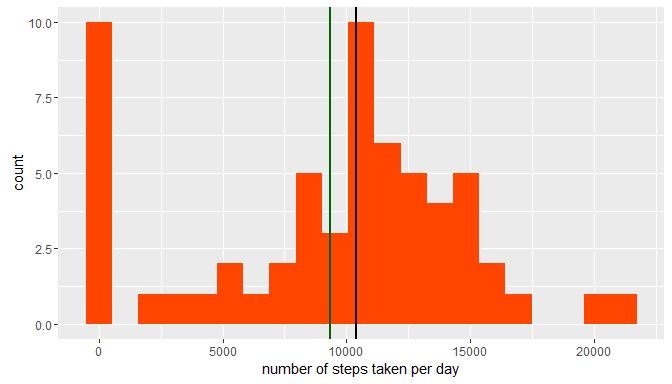

Peer Assignment 1 for the Reproducable Research module in Data Science Specialisation
=====================================================================================

This assignment makes use of data from a personal activity monitoring device which collects data at 5 minute intervals throughout the day. The data consists of two months of data from an anonymous individual collected during the months of October and November, 2012 and include the number of steps taken in 5 minute intervals each day.

We start by loading the libraries needed in running the relevant R packages.

```{r message = FALSE, warning = FALSE, error = FALSE}
library(lubridate)
library(dplyr)
library(tidyr)
library(ggplot2)
```

## Loading and preprocessing the data
The monitoring data is first uploaded to R for preprocessing and is stored in a data frame `activity`. The date column is formatted into POSIXct format. The interval column is converted into factors. We also note that the file has a number of NAs which we'll address later on during processing.
```{r echo=TRUE}
activity <- read.csv("./activity.csv", header = TRUE, stringsAsFactors = FALSE )
activity$date <- as.POSIXct(activity$date)
activity$interval <- as.factor(activity$interval)

```

Examining the interval values in `activity$interval`, it is clear that the data points represent five-minute time intervals in hours and minutes. In order to make them print out properly in plots later on the invervals are converted into strings more clearly showing the time instant in question.
```{r echo=TRUE}
intervalLevels <- levels(activity$interval)
intervalLevels <-  gsub(" ", "0", sprintf("%4s", intervalLevels))
tmp <- strsplit(intervalLevels, "")
tmp2 <- sapply(tmp, function(x) {paste0(x[1:2], collapse = "")})
tmp3 <- sapply(tmp, function(x) {paste0(x[3:4], collapse = "")})
intervalLevels <- paste(tmp2, tmp3, sep=":", collapse = NULL)
levels(activity$interval) <- intervalLevels
```

At this stage we have converted the `interval` column of the original uploaded data in `activity` into a different representation but the information remains the same.

## What is mean total number of steps taken per day?

The subject's movement was recorded over `r round(activity$date[nrow(activity)] - activity$date[1] +1, digits = 0)` days in five minute intervals.  The next chunk of code calculates 

- the total number of steps taken each day 
- the mean of the total number of steps across all the days
- the median of the total number of steps across all the days

and plots the result as a histogram. Missing values were converted to zeros, so dates with no values for steps at all fall into the left-most bin of the histogram.
```{r echo=TRUE}
dailyActivity <- activity%>%group_by(date)%>%summarise(sum(steps, na.rm = TRUE))
names(dailyActivity) <- c("date","dailysteps")
meanSteps <- round(mean(dailyActivity$dailysteps, na.rm = TRUE), digits = 0)
medianSteps <- median(dailyActivity$dailysteps, na.rm = TRUE)
bins = range(dailyActivity$dailysteps)[2]
```

It turns out that the *median* number of daily steps is `r medianSteps` and the *mean* number of daily steps is `r meanSteps`. The binwidth used in the histogram is `r round(bins/20, digits = 0)` which appears a reasonable size for the distribution in question. Using smaller bidwidths tends to brek the histogram into separate bars with white space between them. The fact that the distribution's mean is smaller than its median shows that the distribution is skewed left. This is due to the days with missing data being converted to zero steps.

```{r echo=TRUE, fig.height = 4}
ggplot(dailyActivity, aes(x=dailysteps)) + geom_histogram(binwidth = bins/20, fill = "orangered") + geom_vline(size=1, aes(xintercept = medianSteps)) + geom_vline(size=1, color = "darkgreen", aes( xintercept = meanSteps)) + labs(x="number of steps taken per day")

```

The median of daily steps is shown as a black vertical line on the histogram whereas the mean is a green vertical line to the left of the median.

## What is the average daily activity pattern?

In this section we evaluate the daily activity pattern for the subject. Each five minute interval (288 of them across one day) is averaged over all the days in the measurement period. Note that missing values are not included in the computation. These averages are plotted and shown over a 24-h interval.

```{r echo=TRUE}
fiveminActivity <- activity%>%group_by(interval)%>%summarise(mean(steps, na.rm = TRUE))
names(fiveminActivity) <- c("interval","meansteps")
# generate tick spacing and marks for the x axis of the plot
hops <- seq(from = 1, to = length(intervalLevels), by = 12)

p <- ggplot(fiveminActivity, aes(x=as.numeric(interval), y = meansteps)) + geom_line() + labs(x="interval", y = "number of steps")
p + scale_x_continuous(breaks = seq(1,288, 12), labels = intervalLevels[hops]) + theme(axis.text.x=element_text(angle=90,hjust=1))
```
Below we calculate at which time interval the maximum number of steps was taken.
```{r echo=TRUE}
maxSteps <- fiveminActivity$meansteps[which.max(fiveminActivity$meansteps)]
maxStepsTime <- fiveminActivity$interval[which.max(fiveminActivity$meansteps)]
nextInterval <- fiveminActivity$interval[which.max(fiveminActivity$meansteps)+1]
```
The maximum number of steps taken on an average day took place during the interval `r maxStepsTime` - `r nextInterval`.

## Imputing missing values

At this step we analyse the data more closely and identify how many missing values it has in total. 
```{r echo = TRUE}
missingIntervals <- is.na(activity$steps)
counter <- table(missingIntervals)
```
The number of missing items from the `activity$steps` column is `r counter[2]`, which is a total of `r round(100*mean(missingIntervals),digits = 2)`% of all the observations. This is a fairly high figure, so simply removing those rows from the dataset will considerably reduce the number of observable data. It is better to impute the missing figures by replacing a missing five-minute interval value with the overall mean of the *same* five-minute interval value calculated earlier.

The missing values appear to be concentrate on specific calendar days, i.e. a day either has no missing `steps` values or all its `steps` values are missing. In total, fully eight dates are missing completely of `steps` data. 

The code chunk below replaces all the rows in `activity` having NAs in `activity$steps` with the respective five-minute-interval mean over all the observed days. The other rows continue to have the original data points from the uploaded file.

```{r echo=TRUE}
missingData <- activity[missingIntervals, ]
mergedMissing <- merge(missingData, fiveminActivity, by = "interval")
tmp <- mergedMissing %>% mutate(steps = meansteps)%>%select(interval, steps, date)
missingData2 <- unique(merge(missingData, tmp, by = "interval")%>%select(steps.y, date.x,interval))
names(missingData2) <- c("steps", "date","interval")
missingData <- arrange(missingData2, date, interval)
activity[missingIntervals, ] <- missingData[, ]
```

### Recalculation with imputed data

Now we have a new dataset where the missing values are imputed with the average value for each interval across the number of days. Let's recalculate the mean total number of steps taken each day. 
```{r echo=TRUE}
dailyActivity2 <- activity%>%group_by(date)%>%summarise(sum(steps, na.rm = TRUE))
names(dailyActivity2) <- c("date","dailysteps")
meanSteps2 <- round(mean(dailyActivity2$dailysteps, na.rm = TRUE), digits = 0)
medianSteps2 <- round(median(dailyActivity2$dailysteps, na.rm = TRUE), digits = 0)
bins = range(dailyActivity2$dailysteps)[2]
statistics <- data.frame(c("mean", "median"), c(as.integer(meanSteps), as.integer(medianSteps)), c(as.integer(meanSteps2), as.integer(medianSteps2)))
names(statistics) <- c("centraltendency","withNAs","imputedNAs")
                          
```

It turns out that the median number of daily steps is `r as.integer(medianSteps2)` and the mean number of daily steps is `r as.integer(meanSteps2)`. When the median and mean values for the dataset with missing values are compared to these, we can see that the left-skewed characteristics of the distribution disappears (due to imputing NAs with average values).
```{r echo=FALSE}
statistics
```
The histogram shows a marked reduction in the left-most bin centered around zero steps, since the missing values were imputed. This time also the vertical lines showing mean and median overlap, which shows that the distribution is no longer skewed. More values are centered around the bar with highest frequency as the missing value days were converted to average across all the days.

```{r echo=TRUE, fig.height = 4}
ggplot(dailyActivity2, aes(x=dailysteps)) + geom_histogram(binwidth = bins/20, fill = "orangered") + geom_vline(size=1, aes(xintercept = medianSteps2)) + geom_vline(size=1, color = "darkgreen", aes( xintercept = meanSteps2)) + labs(x="number of steps taken per day")

```

## Are there differences in activity patterns between weekdays and weekends?

In this section we look into whether there are any differences in the activity patterns for the subject between weekdays and weekends.First we add a new column to `activity` named `dayofweek`. This new column will hold the factor `weekday` for days of Monday, Tuesday, Wednesday, Thursday and Friday; and `weekend` for Saturday and Sunday. 

```{r echo=TRUE}
activity <- mutate(activity, dayofweek = weekdays(date))
weekendDays <- grepl("^S", weekdays(activity$date))
activity$dayofweek[weekendDays] <- "weekend"
activity$dayofweek[!weekendDays] <- "weekday"
activity$dayofweek <- as.factor(activity$dayofweek)
```

```{r echo=TRUE}
fiveminActivity2 <- activity%>%group_by(interval, dayofweek)%>%summarise(mean(steps, na.rm = TRUE))
names(fiveminActivity2) <- c("interval","dayofweek","meansteps")
hops <- seq(from = 1, to = length(intervalLevels), by = 12)
p <- ggplot(fiveminActivity2, aes(x=as.numeric(interval), y = meansteps)) + geom_line() + labs(x="interval", y = "number of steps") + facet_grid(dayofweek~.)
p + scale_x_continuous(breaks = seq(1,288, 12), labels = intervalLevels[hops]) + theme(axis.text.x=element_text(angle=90,hjust=1))
```

We can see a pattern which is likely expected, i.e. the subject gets up and starts moving quite a bit earlier on weekdays than during weekend. The subject also settles down and moves less earlier during weekday evenings. 

